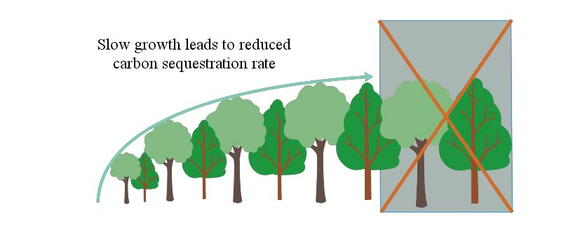

  

# 🌲 Forest-Carbon-Sequestration-Models 🌍

## 📜 Introduction

This repository contains the research and models from the paper **"Forest-Carbon-Sequestration-Models"**. The study explores sustainable forest management strategies to maximize carbon sequestration, biodiversity, and ecological benefits. It uses advanced modeling techniques like **Richards Equation**, **Logistic Growth Curve**, and **LSTM Neural Networks**.

## 🌳 Features

- **Carbon Sequestration Models:** Analyze and predict forest carbon storage over time.
- **Forest Management Strategies:** Optimize logging cycles, tree species, and reforestation plans.
- **Application:** Case study on Shenandoah National Park, predicting carbon fixation over 100 years.
- **Multi-Objective Analysis:** Balancing ecological, economic, and social benefits.

## 🚀 Key Models and Methods

### 1. Tree Height and Growth Models
- **Richards Equation:** Models tree height growth with age.
- **Logistic Growth Curve:** Predicts tree population distribution by age.

### 2. Carbon Sequestration Models
- Calculates carbon storage per cubic meter.
- Analyzes the relationship between tree density and carbon fixation efficiency.

### 3. Multi-Objective Forest Management
- **AHP (Analytic Hierarchy Process):** Balances biodiversity, economic value, and carbon storage.
- **Optimal Logging Strategies:** Determines logging cycles, tree ages, and reforestation plans.

### 4. Case Study: Shenandoah National Park
- Predicted carbon fixation for 100 years using **LSTM Neural Networks** and **Logistic Growth Curve**.

## 📚 References

- **Data sourced from:**
  - [Our World in Data](https://ourworldindata.org)
  - [USDA-National Agricultural Statistics Service](https://www.nass.usda.gov/)
  - [National Bureau of Statistics](http://www.stats.gov.cn/)
- **Models implemented with:**
  - **Python:** TensorFlow, NumPy, Matplotlib
  - **MATLAB:** Curve fitting and optimization

---

## 📧 Contact

For any questions, please contact [ziwei.wang3@mail.mcgill.ca](ziwei.wang3@mail.mcgill.ca).
